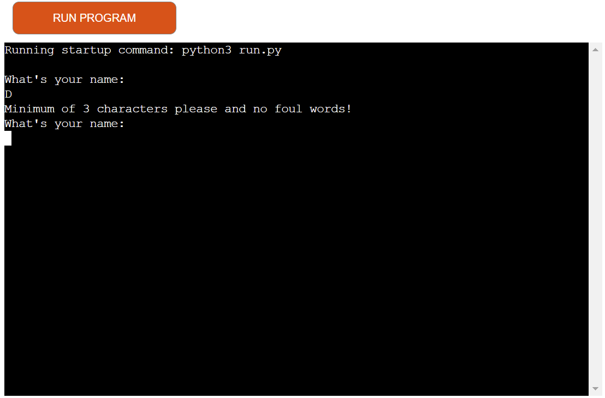
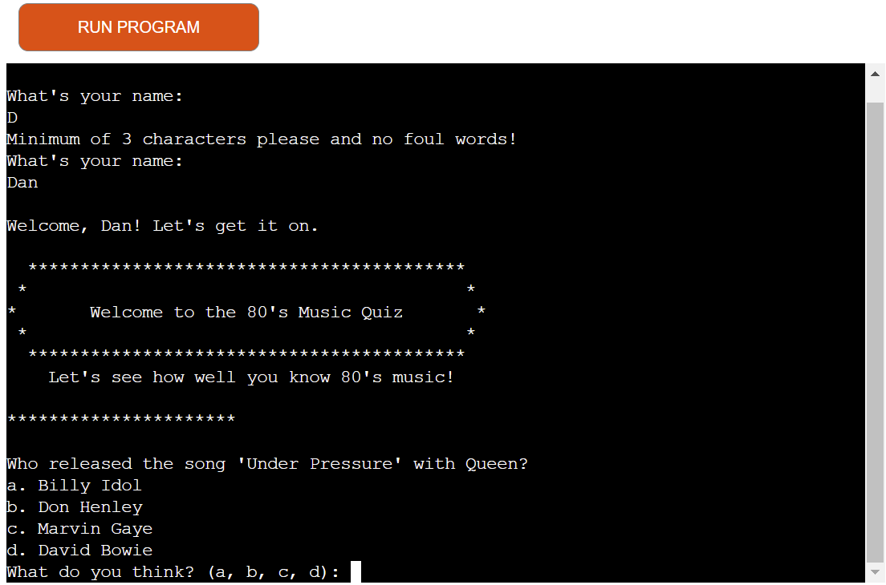
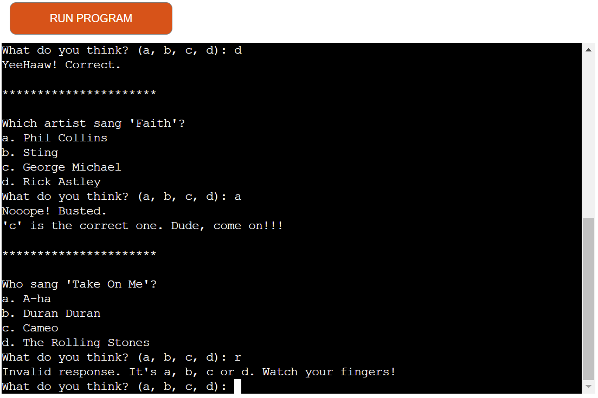
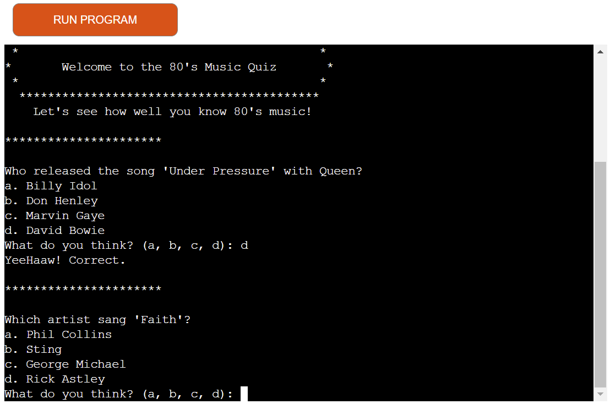
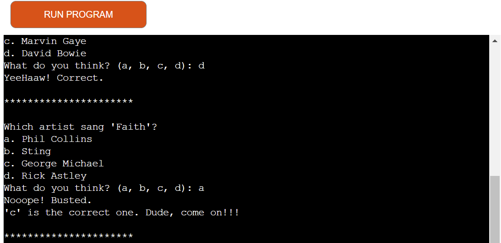
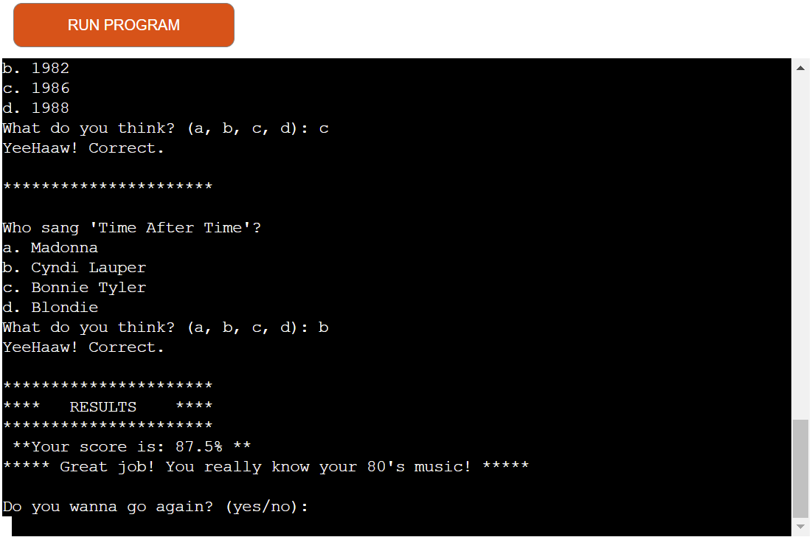
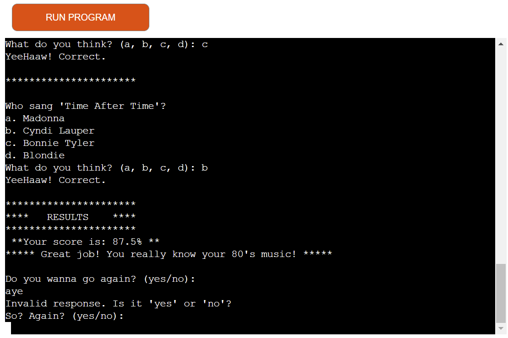
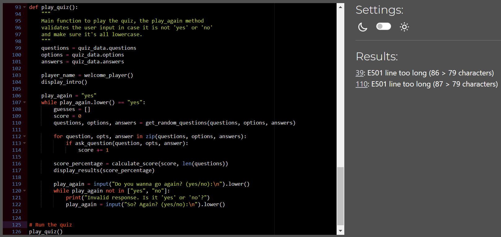

# The 80's Music Quiz (easy version)

* The 80's music quiz game is simple and easy but fun game for everyone who loves quiz games. 
It is running on a mock terminal right now as it is a background game at the moment, but soon it may be a fully-featured game for the public. 
    [Here is the game. Give it a go!](https://the-80s-music-quiz-ca63ac73c2e7.herokuapp.com/)

***

## Technology used

* Python
* Gitpod
* VS Code
* Github
* Heroku

***

## Features - existing

| 1st step - Asking for a name with a validation for minimum 3 characters |
| ------- |
|  |

| 2nd step - Introduction |
| ------- |
|  |

| 3rd step - Answering a question with wrong character input |
| ------- |
|  |

| 4th step - Answering the question correctly |
| ------- |
|  |

| 4th step - Answering the question incorrectly |
| ------- |
|  |

| 5th step - End of questions. Results message different according to percentage |
| ------- |
|  |

| Final step - Play again prompt: Yes: the game restarts. No: the game exits. Invalid: asks again |
| ------- |
|  |

***

## Features - future

* Expand the question base
* Have a scoreboard
* Implement different difficulties
* Add multiplayer mode

***

## Testing

### Validator

| CI linter validator found no significant errors in the code. Shows 2 line too long, but because of the names I can't make it shorter |
| ------- |
|  |

### Manual testing

| Action | Expectation | Result |
| --- | --- | --- |
| Type in name less than 3 character | Game stops and ask for a name longer than 3 character | PASS |
| Choose correct answer | Game going forward with a message | PASS |
| Choose incorrect answer | Game going forward with a message | PASS |
| Type invalid character as answer | Game stops and asks for a valid character | PASS |
| Answering questions | Receiving 8 random questions in each game | PASS |
| Finish game | Game shows results with a message according to reached percentage | PASS |
| End: Type invalid answer for play again question  | The game asks again until receives a valid answer ("yes" or "no") | PASS |
| End: Type "yes" as answer for play again question | The game restarts with new set of questions | PASS |
| End: type "no" as answer for play again question | The game stops and exits | PASS |

### Bugs and fixes

* No bugs been detected

***

## Deployment

* This game was deployed to Heroku
  * Sign up for Heroku
  * Click "create new app"
  * Give the app a unique name
  * Click settings in the section on top of the page
  * Scroll down and press "Add buildpack"
  * Click python first then nodejs (in that order)
  * Click deploy in the section on top of the page
  * Select method "Connect to Github" then press "Connect to Github" button 
  * Search for hangman
  * Click connect
  * Click "Enable automatic deploys" button to enable Heroku to rebuild the app when a new change is pushed to Github

  ***

  ## Credits

  ### Used Code

  * I followed the course material, especially the Love Sandwiches video tutorial.
  * I also took a lot of help from:
      * [Percipio](https://learningpeople.percipio.com/)
      * [stackoverflow](www.stackoverflow.com)
      * [w3schools](www.w3schools.com)
      * Google searches and Youtube video tutorials